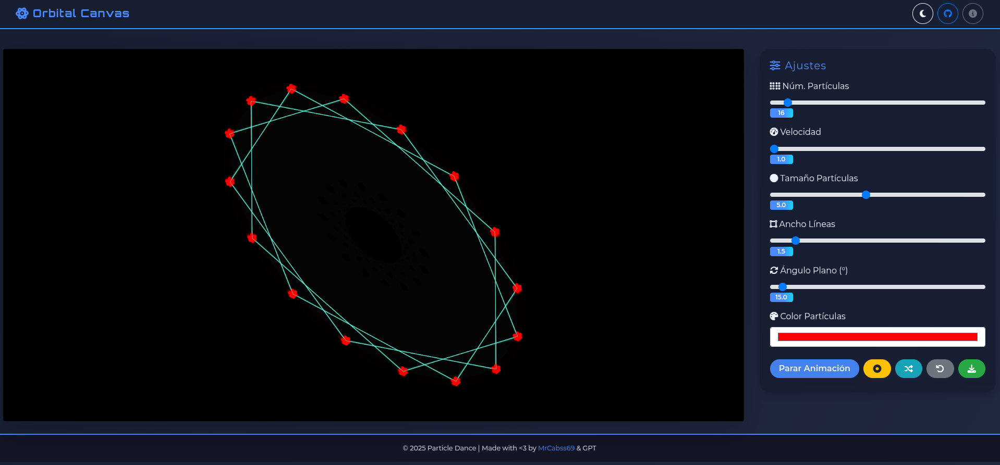

# Orbital Canvas

This is a JavaScript library for creating visual animations of moving particles on a simple HTML canvas.




#### Inspired by: [Geometría Aurea](https://instagram.com/geometria_aurea/)


[Video Demo](resources/demo.mp4)

## Features

- Smooth and customizable particle animation.
- Interactive controls for adjusting parameters in real time.
- Easy integration into any web page.

**NOTE:** Video recording is not tested.

## Quick Start

### Installation

Clone this repository and navigate to the project directory:

```bash
git clone https://github.com/MrCabss69/OrbitalCanvas.git
cd OrbitalCanvas
```

### Usage

```bash
cd src
python3 -m http.server 8000
```
To see the library demo, visit http://0.0.0.0:8000/ on your browser.

**NOTE**: Sometimes, to apply and see some of the fields reflected, you may need to press the 'Reset Animation' button to refresh the view.


Made by: MrCabss. Polished by GPT & Gemini